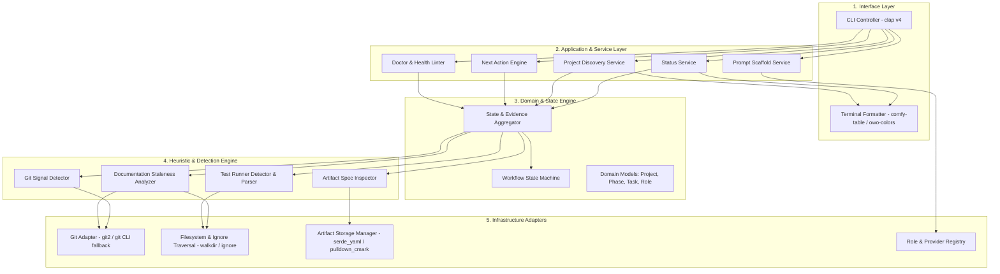

# Technical Architecture & System Design: AIFlow

**Author:** Lead Software Architect & Product Engineer  
**Date:** October 2026  
**Status:** Approved for Architectural Review  
**Project:** AIFlow  

---

## 1. Technology Stack Evaluation & Recommendation

To ensure AIFlow achieves open-source excellence, lightning-fast execution, and seamless maintenance by a solo developer, we evaluated four primary technology stacks against key engineering criteria.

### 1.1. Candidate Comparison Matrix

| Evaluation Criteria | Rust | Go | Python (Typer/Rich) | TypeScript (Node) |
| :--- | :---: | :---: | :---: | :---: |
| **Startup Latency** | **Instant (< 10ms)** | Fast (~20-40ms) | Slow (150-300ms) | Moderate (80-150ms) |
| **Distribution Model** | **Single static binary** | Single static binary | Requires Python + virtualenv/uv | Requires Node.js or heavy Bun packaging |
| **Memory Footprint** | **Minimal (~8MB)** | Small (~20MB) | High (~50-100MB) | High (~60-120MB) |
| **Git Ecosystem** | **Excellent (`git2` / `gix`)** | Good (`go-git`) | Dependent on external `git` CLI | Dependent on `simple-git` |
| **CLI & TUI Libraries** | **`clap`, `ratatui`, `comfy-table`** | `cobra`, `bubbletea` | `typer`, `rich`, `textual` | `commander`, `ink`, `chalk` |
| **Filesystem & Traversal** | **`ignore`, `walkdir` (fastest)** | `filepath.WalkDir` | `os.walk` / `pathlib` | `globby` / `fast-glob` |
| **Type Safety & Reliability**| **Compile-time algebraic types** | Static typing | Runtime type hints (mypy) | TypeScript compile-time |
| **Apple Silicon Performance** | **First-class native `aarch64`** | First-class native `aarch64`| Architecture-dependent venvs | Node architecture-dependent |

### 1.2. Architectural Decision: Choose Rust

**Decision:** We recommend **Rust** as the implementation language for AIFlow.

#### Rationale:
1. **Sub-15ms Execution Speed:** As a tool developers run dozens of times a day (`aiflow status`, `aiflow next`), instantaneous startup is paramount. Python's interpreter startup overhead alone exceeds our target latency budget.
2. **Zero-Dependency Single Binary Distribution:** Rust compiles directly to a standalone binary for macOS Apple Silicon (`aarch64-apple-darwin`), Intel macOS (`x86_64-apple-darwin`), and Linux. Users can install via `brew install aiflow` or `cargo install aiflow` without worrying about Python versions, virtual environments, or Node runtime installations.
3. **World-Class CLI & Git Ecosystem:** The modern terminal tooling revolution (e.g. `ripgrep`, `bat`, `delta`, `starship`, `git-cliff`, `jujutsu`) is built in Rust. Crates such as `clap` (v4 with derive macros), `ratatui` / `crossterm`, `comfy-table`, `serde`, and `ignore` provide unparalleled speed and aesthetic capabilities.
4. **Compile-Time State Machine Guarantees:** Rust’s rich type system (algebraic enums, pattern matching, `Result<T, E>`) makes invalid state transitions mathematically impossible at compile time, eliminating runtime crashes.

### 1.3. Keeping Rust Simple & AI-Friendly (Lean Architecture for Solo Developers)

Because you are exploring Rust for the first time and collaborating with AI tools (ChatGPT, Claude, Codex):
- **Zero Async Complexity:** We do NOT use `tokio` or async runtimes. AIFlow is a synchronous CLI tool executing fast filesystem and git operations in memory. This eliminates complex lifetime and async-trait headaches.
- **Minimal, Focused Dependency Tree:** We stick strictly to proven, idiomatic crates (`clap` for CLI, `serde`/`serde_yaml` for config, `comfy-table` for tables, `owo-colors` for styling).
- **Small, Modular Source Files:** Every module is intentionally kept between 80 to 200 lines. This ensures ChatGPT can ingest, generate, debug, and explain any single file in a single chat turn without truncation or token exhaustion.
- **Procedural Clarity over Macro Magic:** Avoid nested custom macros. Use straightforward `match` statements and standard `Result<T, MyError>` idioms that are easy to read and understand.
- **Estimated MVP Footprint:** The entire working MVP is designed to be **under 1,000 lines of clean Rust**, making it approachable, maintainable, and completely transparent.

---

## 2. Layered Modular Architecture

AIFlow follows a clean, decoupled hexagonal / layered architecture.



---

## 3. Repository Structure

```
aiflow/
├── Cargo.toml                       # Workspace manifest & dependencies
├── README.md                        # Project overview & quickstart
├── LICENSE-MIT / LICENSE-APACHE     # Dual open-source license
├── build.rs                         # Manpage & shell completions generator
├── src/
│   ├── main.rs                      # Application entry point & error handling
│   ├── lib.rs                       # Library root (re-exports for integration testing)
│   ├── cli/                         # CLI interface definitions
│   │   ├── mod.rs
│   │   ├── args.rs                  # Clap command line parsing structures
│   │   ├── commands/                # Individual command handlers
│   │   │   ├── init.rs
│   │   │   ├── status.rs
│   │   │   ├── next.rs
│   │   │   ├── projects.rs
│   │   │   ├── phase.rs
│   │   │   ├── task.rs
│   │   │   ├── test.rs
│   │   │   ├── docs.rs
│   │   │   ├── doctor.rs
│   │   │   └── prompt.rs
│   │   └── ui/                      # Terminal rendering, colors, Unicode tables
│   │       ├── mod.rs
│   │       ├── theme.rs
│   │       └── table.rs
│   ├── domain/                      # Pure domain models (zero framework dependencies)
│   │   ├── mod.rs
│   │   ├── project.rs               # Project metadata & identity
│   │   ├── phase.rs                 # Phase enum, ordering, preconditions
│   │   ├── task.rs                  # Task model & checklist parser
│   │   ├── role.rs                  # Architect, Implementer, Reviewer, Tester
│   │   └── state.rs                 # ProjectState, Evidence, NextAction
│   ├── engine/                      # Workflow & State Machine logic
│   │   ├── mod.rs
│   │   ├── fsm.rs                   # Finite State Machine & transition rules
│   │   └── next_action.rs           # Next action heuristic calculation
│   ├── heuristics/                  # Signal extraction & inference
│   │   ├── mod.rs
│   │   ├── git_signals.rs           # Branch names, commit prefixes, dirty tree
│   │   ├── test_signals.rs          # Test runner discovery & exit code inspect
│   │   ├── doc_staleness.rs         # Commit timestamp diff analyzer
│   │   └── artifact_signals.rs      # .aiflow/* markdown parser
│   ├── adapters/                    # External system integrations
│   │   ├── mod.rs
│   │   ├── git/                     # Git integration (libgit2 + CLI fallback)
│   │   │   ├── mod.rs
│   │   │   └── repo.rs
│   │   ├── test_runners/            # Pluggable test runner adapters
│   │   │   ├── mod.rs
│   │   │   ├── cargo.rs
│   │   │   ├── pytest.rs
│   │   │   ├── npm.rs
│   │   │   └── go.rs
│   │   ├── storage/                 # YAML and Markdown persistence
│   │   │   ├── mod.rs
│   │   │   ├── project_yaml.rs
│   │   │   ├── state_yaml.rs
│   │   │   └── tasks_md.rs
│   │   └── config/                  # Global configuration (~/.config/aiflow/)
│   │       └── global_config.rs
│   └── services/                    # Application services
│       ├── mod.rs
│       ├── discovery.rs             # Multi-repo recursive discovery
│       ├── status.rs                # Aggregated status evaluation
│       └── doctor.rs                # Health check rules & remediation
├── tests/                           # Integration & End-to-End tests
│   ├── common/                      # Test helpers (synthetic git repo generator)
│   │   └── test_repo.rs
│   ├── cli_status_test.rs           # E2E status output assertions
│   ├── fsm_transitions_test.rs      # State machine unit & integration tests
│   └── heuristics_test.rs           # Signal extraction test cases
└── docs/                            # Comprehensive engineering specifications
    ├── PRODUCT.md
    ├── ARCHITECTURE.md
    ├── REQUIREMENTS.md
    ├── PROJECT_PLAN.md
    └── RESEARCH.md
```

---

## 4. Data Models & Schemas

### 4.1. Global Configuration (`~/.config/aiflow/config.yaml`)
```yaml
version: "1.0"
# Directories to scan for Git repositories
workspace_roots:
  - "~/Projects"
  - "~/Shrinkhal-Github"
  - "~/Work"

# Global default AI role-to-provider mappings
roles:
  architect: "claude-3-7-sonnet"
  implementer: "codex"
  reviewer: "gemini-2.5-pro"
  tester: "gemini-2.5-pro"
  approver: "human"

# Display & formatting preferences
display:
  color: true
  unicode_icons: true
  max_recent_commits: 5
```

### 4.2. Local Project Identity (`.aiflow/project.yaml`)
```yaml
name: "Autonomous Navigation"
version: "0.2.0"
description: "Edge AI obstacle avoidance system for autonomous drones"
language: "python"
created_at: "2026-09-15T10:00:00Z"

# Overrides for test runner if auto-detection needs specific flags
test_runner:
  command: "pytest tests/ -v"
  auto_detect: true

# Project-specific AI role overrides
roles:
  architect: "claude-3-7-sonnet"
  implementer: "codex"
  reviewer: "gemini-2.5-pro"
```

### 4.3. Default Workflow Definition: 5-Phase Standard (`.aiflow/workflow.yaml`)
```yaml
version: "1.0"
name: "Standard AI Workflow"
preset: "standard"
initial_phase: "specify"

phases:
  - id: "specify"
    name: "Specify"
    role: "architect"
    required_artifacts: [".aiflow/spec.md"]
    requires_human_approval: true
    next_phase: "plan"

  - id: "plan"
    name: "Plan"
    role: "architect"
    required_artifacts: [".aiflow/tasks.md"]
    requires_human_approval: false
    next_phase: "build"

  - id: "build"
    name: "Build"
    role: "implementer"
    required_artifacts: []
    requires_human_approval: false
    next_phase: "verify"

  - id: "verify"
    name: "Verify"
    role: "tester"
    preconditions:
      - "all_tasks_completed"
      - "test_suite_passing"
    requires_human_approval: true
    next_phase: "ship"

  - id: "ship"
    name: "Ship"
    role: "approver"
    requires_human_approval: true
    next_phase: null
```
*(Presets available: `--preset standard` (default 5 phases), `--preset lean` (4 phases), `--preset rigorous` (10 phases)).*


### 4.4. Durable Project State (`.aiflow/state.yaml`)
```yaml
version: "1.0"
current_phase: "implementation"
phase_started_at: "2026-09-28T14:30:00Z"
completed_phases:
  - phase: "requirements"
    completed_at: "2026-09-16T11:00:00Z"
    approved_by: "human"
  - phase: "research"
    completed_at: "2026-09-18T16:20:00Z"
    approved_by: "claude-3-7-sonnet"
  - phase: "architecture"
    completed_at: "2026-09-22T09:15:00Z"
    approved_by: "human"
  - phase: "planning"
    completed_at: "2026-09-24T12:00:00Z"
    approved_by: "human"
  - phase: "tasks"
    completed_at: "2026-09-25T15:45:00Z"
    approved_by: "codex"

active_task_id: "TASK-04"
blockers: []
```

### 4.5. Tasks Specification (`.aiflow/tasks.md`)
```markdown
# Project Tasks: Autonomous Navigation

## Phase: Implementation
- [x] TASK-01: Set up OpenCV hardware acceleration pipeline <!-- done: 2026-09-26 -->
- [x] TASK-02: Implement YOLOv8 tensor parsing module <!-- done: 2026-09-27 -->
- [x] TASK-03: Create depth-map fusion adapter <!-- done: 2026-09-28 -->
- [ ] TASK-04: Implement object-detection visualization (Active)
- [ ] TASK-05: Integrate telemetry websocket streaming

## Phase: Testing
- [ ] TASK-06: Add unit tests for bounding box collision math
- [ ] TASK-07: Add synthetic video integration tests
```

---

## 5. Automatic State & Drift Detection Strategy

The core differentiator of AIFlow is its multi-signal state derivation engine. Rather than forcing the developer to manually update files, AIFlow synthesizes signals across 4 domains:

```
  ┌─────────────────────────────────────────────────────────────┐
  │                    Signal Aggregator                        │
  └───────┬──────────────┬──────────────┬──────────────┬────────┘
          │              │              │              │
          ▼              ▼              ▼              ▼
     Git Signals    File Signals   Test Signals   Doc Signals
     • Branch       • .aiflow/*    • Runner pass/ • src vs doc
     • Diffs        • tasks.md       fail status    commit delta
     • Commits      • Code files   • Test reports • Mtime delta
```

### 5.1. Signal Evaluation Rules

| Signal Domain | Observable Fact | Inferred Phase / Status | Confidence |
| :--- | :--- | :--- | :---: |
| **Git Branch** | Branch matches `phase/03-architecture` or `arch/*` | Architecture | High |
| **Git Branch** | Branch matches `phase/06-impl`, `feat/*`, `fix/*` | Implementation | Medium |
| **Commit Messages** | Recent commits match `feat:`, `impl:`, `refactor:` | Implementation | Medium |
| **Commit Messages** | Recent commits match `test:`, `test(detector):` | Testing | Medium |
| **Artifacts** | `.aiflow/requirements.md` has unfilled placeholders | Incomplete Requirements | High |
| **Artifacts** | All tasks in `tasks.md` checked `[x]` | Ready for Testing | High |
| **Test Runner** | Test report has failures | Testing (Failing) | High |
| **Doc Freshness**| >10 commits touching `src/` since last `README.md`/`docs/` touch | Documentation Stale | High |

### 5.2. Next Action Calculation Algorithm

```
function compute_next_action(project_state, evidence):
    if project_state.current_phase == "requirements":
        if not file_exists(".aiflow/requirements.md"):
            return ("Create .aiflow/requirements.md", Role::Human, "aiflow init")
        if file_has_placeholders(".aiflow/requirements.md"):
            return ("Complete requirements specification", Role::Human, "edit .aiflow/requirements.md")
        return ("Approve requirements and advance", Role::Human, "aiflow phase complete")

    if project_state.current_phase == "architecture":
        if not file_exists(".aiflow/architecture.md"):
            return ("Draft architecture with Claude", Role::Architect, "aiflow prompt --role architect")
        if not project_state.has_human_approval("architecture"):
            return ("Review & approve architecture", Role::Human, "aiflow phase complete")

    if project_state.current_phase == "implementation":
        if evidence.has_active_task():
            return (format!("Implement {}", evidence.active_task.name), Role::Implementer, "aiflow prompt --role implementer")
        if evidence.all_tasks_completed():
            return ("All implementation tasks done → run test suite", Role::Tester, "aiflow test run")

    if project_state.current_phase == "testing":
        if evidence.tests_failing():
            return ("Fix failing tests with Codex/Gemini", Role::Implementer, "aiflow test run")
        return ("Tests passing → request code review with Gemini", Role::Reviewer, "aiflow phase complete")

    if project_state.current_phase == "review":
        return ("Perform deep review with Gemini/Claude", Role::Reviewer, "aiflow prompt --role reviewer")

    if project_state.current_phase == "documentation":
        if evidence.docs_stale():
            return ("Update README and API docs", Role::Reviewer, "aiflow docs update")
        return ("Documentation up-to-date → advance to release", Role::Human, "aiflow phase complete")

    return ("Verify project health", Role::Human, "aiflow doctor")
```

---

## 6. CLI Command Specification & Terminal UX

### 6.1. Command Hierarchy
- `aiflow`
  - `init [--path <dir>] [--type <rust|python|node|go>]`
  - `status [--json]`
  - `next [--explain]`
  - `projects [--all] [--filter <phase>]`
  - `phase [status | next | complete | set <id>]`
  - `task [list | active | done <id> | add <text>]`
  - `test [run | status]`
  - `docs [check | update]`
  - `doctor [--fix]`
  - `prompt --role <architect|implementer|reviewer|tester>`

### 6.2. Mock Terminal Output: `aiflow status`

```text
Project:      Autonomous Navigation (python)
Location:     /Users/shrinkhals/Projects/autonomous-nav
Last Active:  12 minutes ago (commit 8f3c1b2)

Workflow Progress (Preset: Lean):
  ✓ 1. Plan           (Architecture & Scope approved by Human)
  → 2. Build          [ACTIVE - Codex: TASK-04]
  ○ 3. Verify         (Tests & Code Review)
  ○ 4. Ship           (Docs & Release)

Git Status:
  Branch:       phase/02-object-detection
  Working Tree: 3 modified, 1 untracked
  Upstream:     ahead 1 commit

Test Suite (pytest):
  Status:       14 passed, 2 failed
  Last Run:     45 minutes ago

Current Task:
  TASK-04: Implement object-detection visualization

Documentation:
  Status:       Synchronized (README.md updated 2 days ago)

Next Logical Action:
  → Fix 2 failing tests in test_detector.py with Codex/Gemini
  → Run: aiflow test run
  → Assigned Role: Implementer (Codex)
```

### 6.3. Mock Terminal Output: `aiflow projects`

```text
AIFlow Multi-Project Dashboard (4 tracked repositories)

Project                 Phase             Git Status         Tests     Health     Action Needed
------------------------------------------------------------------------------------------------------
Autonomous Navigation   Implementation   phase/02-detection 14/2 fail Attention  Fix 2 failed tests
OnyxBookingSystem       Testing          feat/stripe-v2     All pass  Active     Request code review
OnyxLink                Release          main (clean)       All pass  Done       Ready to tag release
AIFlow                  Architecture     main (clean)       N/A       Active     Approve architecture.md
```

---

## 7. Testing Strategy

### 7.1. Testing Matrix

| Level | Focus | Tooling / Harness | Target Coverage |
| :--- | :--- | :--- | :---: |
| **Unit Tests** | FSM transitions, YAML deserializers, Markdown task checklist parser, Next Action engine | `cargo test --lib` | $\ge 85\%$ |
| **Integration Tests** | Git adapter, signal extraction from real git repos, directory discovery | `tempfile`, synthetic git repo fixture | $\ge 80\%$ |
| **CLI E2E Tests** | Terminal exit codes, stdout formatting, argument validation, `--json` parity | `assert_cmd`, `predicates` | 100% of subcommands |
| **Snapshot Tests** | Terminal formatting stability across releases | `insta` | Status and dashboard views |

### 7.2. Synthetic Git Repo Test Fixture
A reusable test fixture creates temporary Git repositories on disk, runs synthetic commits, switches branches, and verifies that AIFlow's heuristic engine correctly detects phases without false positives.
