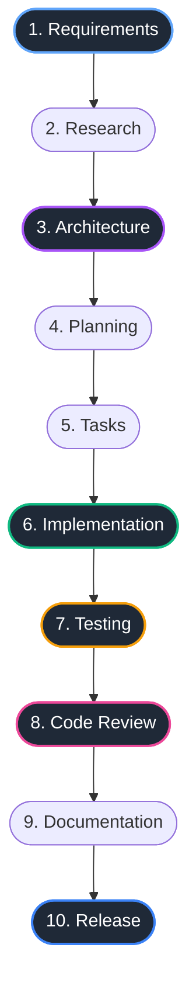

# Product Vision & Strategy: AIFlow

**Author:** Lead Software Architect & Product Engineer  
**Date:** October 2026  
**Status:** Approved for Architectural Review  
**Project:** AIFlow  

---

## 1. Vision & Mission Statement

### The Problem
In 2026, software developers are no longer constrained by the speed of manual typing. Modern AI coding agents (Claude Code, OpenAI Codex, Gemini CLI, Cursor, Windsurf, Aider) can generate hundreds of lines of code in seconds. However, this has created a new, acute failure mode: **Agentic Chaos & Cognitive Fragmentation**.

When developers manage multiple projects with AI agents:
1. **Context Amnesia:** Switching between 3 to 10 local repositories makes it difficult to remember what phase a project is in, what was just finished, and what remains to be done.
2. **Process Drift ("Vibe Coding"):** Agents are frequently prompted to jump straight into raw implementation before requirements, architecture, or test plans are established. The resulting code often lacks architectural coherence, fails edge cases, and lacks test coverage.
3. **Agent Role Confusion:** Different AI models have distinct cognitive strengths (e.g., Claude excels at deep architectural reasoning and nuanced review; Codex excels at fast implementation and refactoring; Gemini excels at multimodal analysis, large-context verification, and adversarial test generation). Without a formal framework, developers use whichever model is at hand, producing suboptimal results.
4. **State Desynchronization:** Code evolves while specifications, tests, and documentation become stale, causing silent technical debt.

### The Mission
**AIFlow is a local developer workflow and project-tracking CLI for software developers who use AI coding agents.**

AIFlow is **NOT** another AI coding agent. Its mission is to be the **developer’s flight control system**:
- It tracks the development state of all Git repositories on the developer's machine.
- It provides immediate, high-fidelity visibility into what project is active, what phase it is in, and what has been completed.
- It dynamically computes the **next logical action** to advance the project.
- It recommends the **assigned AI role/tool** for the current phase.
- It continuously verifies that code, tests, documentation, and Git state remain consistent with the defined project workflow.

---

## 2. Core Philosophy & Guiding Principles

```
  ┌─────────────────────────────────────────────────────────┐
  │                 Human Developer (Executive)             │
  │     Requirements • Architectural Approval • Final Signoff│
  └────────────────────────────┬────────────────────────────┘
                               │ Governs & Guides
                               ▼
  ┌─────────────────────────────────────────────────────────┐
  │                   AIFlow Control Plane                  │
  │     State Engine • Git Signals • Next Action • Doctor   │
  └───────┬────────────────────┼────────────────────┬───────┘
          │                    │                    │
          ▼                    ▼                    ▼
   Claude (Architect)   Codex (Implementer)  Gemini (Review/Test)
  • System Design      • Feature Coding     • Adversarial Testing
  • Tech Decisions     • Refactoring        • Independent Review
  • Deep Code Review   • Routine Fixes      • Staleness Audits
```

### 1. The Developer Remains the Final Decision Maker
AI agents are brilliant assistants, but unreliable authorities. AIFlow explicitly models the human developer as the ultimate executive. Crucial phase gates (approving requirements, accepting an architecture, signing off on a release) require explicit human approval.

### 2. Cognitive Role Separation
AIFlow enforces a clear division of labor, mapping each phase of development to specialized cognitive roles:
- **Claude (The Architect):** System design, technical tradeoffs, architecture review, high-level code structure.
- **Codex (The Implementer):** Code generation, refactoring, routine bug fixes, test implementation.
- **Gemini (The Reviewer & Tester):** Independent adversarial code review, test suite generation, test coverage analysis, context-wide verification.
- **Human Developer (The Lead):** Defining requirements, architectural approval, final review, and validating the implementation.

*(Note: While these are recommended defaults, roles are fully configurable to prevent vendor lock-in.)*

### 3. Git as the Primary Source of Truth
Developers should never have to manually update a database or fill out forms to tell AIFlow what they are doing. AIFlow automatically deduces project status by inspecting Git branches (`phase/*`, `feat/*`), uncommitted file changes, commit messages, recent file modifications, test outputs, and project artifacts.

### 4. Zero Friction, Local-First Privacy
AIFlow operates entirely on the local machine. It stores zero proprietary source code in cloud databases and sends no telemetry. It runs with sub-50ms execution times so developers can run it habitually throughout their workday.

---

## 3. The Canonical Development Workflow

While AIFlow supports configurable state machines, it ships with a battle-tested 10-phase canonical workflow:



### Phase Definitions and Role Allocation

| Phase | Objective | Primary Artifact | Default Role | Assigned Agent | Human Gate |
| :--- | :--- | :--- | :--- | :--- | :---: |
| **1. Requirements** | Define problem, scope, user stories, and acceptance criteria | `.aiflow/requirements.md` | Product / Lead | **Human Developer** | **Required** |
| **2. Research** | Evaluate dependencies, existing libraries, APIs, and prior art | `.aiflow/research.md` | Architect | **Claude** | Optional |
| **3. Architecture** | System design, components, interfaces, data models, ADRs | `.aiflow/architecture.md` | Architect | **Claude** | **Required** |
| **4. Planning** | Milestone definitions, phasing strategy, risk assessment | `.aiflow/plan.md` | Architect / Lead | **Claude + Human** | **Required** |
| **5. Tasks** | Granular, executable task list with clear completion criteria | `.aiflow/tasks.md` | Implementer | **Claude / Codex** | Optional |
| **6. Implementation**| Writing feature code, internal refactoring, bug fixes | Source code (`src/`, etc.)| Implementer | **Codex** | Continuous |
| **7. Testing** | Unit, integration, and regression test suites | Test suites (`tests/`, etc.)| Tester | **Gemini + Codex** | Automated |
| **8. Code Review** | Adversarial review, linting, security and design audit | Review report / comments | Reviewer | **Gemini + Claude**| **Required** |
| **9. Documentation** | Updating README, user manuals, API docs, changelog | `README.md`, `docs/` | Technical Writer | **Gemini / Claude**| Optional |
| **10. Release** | Tagging, changelog release notes, build artifact verification| Git tag, release notes | Release Engineer | **Human Developer** | **Required** |

---

## 4. User Personas & Use Cases

### Persona 1: The Polyglot Solo Architect (Primary Persona)
- **Profile:** An experienced senior engineer building 3–5 commercial or open-source projects simultaneously using AI coding agents.
- **Pain Point:** Spends 20 minutes every morning trying to figure out which branch is active, whether tests passed before sleeping, which prompt to feed to Claude, and which project needs immediate attention.
- **Journey with AIFlow:**
  1. Opens terminal, types `aiflow projects`. Immediately sees an overview of all 5 projects, highlighting that Project A has failing tests, Project B is awaiting architectural approval, and Project C is ready for release.
  2. Runs `cd ~/projects/autonomous-nav && aiflow status`. Gets a rich dashboard showing the current phase (`Implementation`), active branch (`phase/02-detection`), 3 modified files, and current task.
  3. Runs `aiflow next`. AIFlow advises: *"Implement object-detection visualization in src/detector.py → Run pytest → Hand off to Gemini for review."*
  4. Runs `aiflow prompt --role implementer`. AIFlow outputs a structured prompt pre-injected with the task spec, recent diff context, and architectural guidelines, ready to paste into Codex/Claude.

### Persona 2: The Engineering Lead / Tech Lead
- **Profile:** Manages a team of developers using AI coding tools.
- **Pain Point:** Developers push AI-generated code directly to PRs without formal specifications, without running tests, or without updating documentation.
- **Journey with AIFlow:**
  1. Enforces `.aiflow/` conventions across company repositories.
  2. Integrates `aiflow doctor` into git pre-push hooks or CI pipelines. If an engineer attempts to jump to the `Implementation` phase before `requirements.md` is approved, or attempts to mark a phase complete while tests fail or docs are stale, the hook blocks the push with clear remediation steps.

---

## 5. Scope Boundaries: What AIFlow IS vs. What It IS NOT

| In Scope (What AIFlow IS) | Out of Scope (What AIFlow IS NOT) |
| :--- | :--- |
| **Local-first developer control plane** | An AI coding agent that autonomously edits code files |
| **Cross-repository project tracking CLI** | A cloud-hosted web SaaS platform or Jira replacement |
| **Automatic state detection engine** (Git + artifacts + tests) | A proprietary LLM provider or closed AI ecosystem |
| **Next-action recommendation system** | A full graphical IDE (VS Code / JetBrains fork) |
| **Workflow linter and health validator (`aiflow doctor`)** | An invasive Git wrapper that rewrites git history |
| **Neutral role-to-provider prompt dispatcher** | A persistent chat interface / conversational bot |

---

## 6. Success Metrics & Product KPIs

For an open-source tool built for daily personal and community use, success is measured by developer delight, speed, and workflow fidelity:

1. **Terminal Latency:**
   - `aiflow status`: < 30ms (feels instantaneous).
   - `aiflow projects` (scanning up to 50 local repos): < 200ms.
2. **Context Recovery Time:** Reduces the time required for a developer to resume a suspended project from 10 minutes to under 10 seconds.
3. **Drift Prevention:** 100% of projects using AIFlow maintain synchronized documentation and passing test suites before release.
4. **Developer Adoption:** Clean zero-dependency installation via Homebrew, Cargo, or direct binary download.
