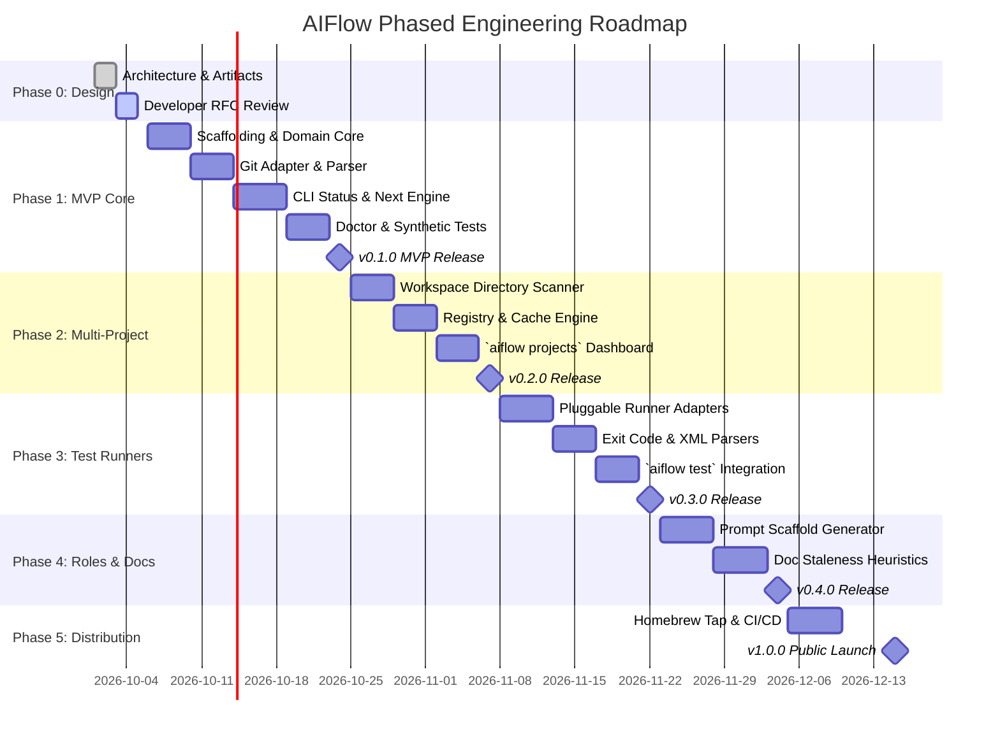

# Project Plan & Development Roadmap: AIFlow

**Author:** Lead Software Architect & Product Engineer  
**Date:** October 2026  
**Status:** Approved for Architectural Review  
**Project:** AIFlow  

---

## 1. Minimum Viable Product (MVP) Definition

To deliver rapid developer value and establish a rock-solid foundation, AIFlow adopts an iterative delivery model. The Minimum Viable Product (MVP) focuses on delivering the single-repository flight controller before expanding to multi-repo aggregation.

### 1.1. In-Scope for MVP (Milestone 1)
- [x] **Project Initialization (`aiflow init`):**
  - Scaffolds `.aiflow/` directory with clean, minimal schema files (`project.yaml`, `workflow.yaml`, `state.yaml`, `plan.md`, `tasks.md`).
  - Supports `--preset lean` (default 4 phases), `--preset standard` (5 phases), or `--preset rigorous` (10 phases).
  - Auto-detects project name and primary programming language.
  - Automatically appends `.aiflow/.cache/` to `.gitignore`.
- [x] **Git Read-Only Adapter:**
  - Fast, safe inspection of current branch, uncommitted files, and recent commit messages without taking index locks or mutating repository history.
- [x] **Workflow State Machine:**
  - Deterministic finite state machine running the Lean 4-Phase default (`Plan` → `Build` → `Verify` → `Ship`) with role associations and human approval checkpoints.
  - Manual phase transitions (`aiflow phase next`, `aiflow phase complete`, `aiflow phase set`).
- [x] **Task Checklist Engine:**
  - Parses Markdown task list in `.aiflow/tasks.md`.
  - Commands to inspect active task, list pending tasks, and mark tasks complete (`aiflow task done <id>`).
- [x] **Status Dashboard (`aiflow status`):**
  - Rich, colorized terminal display rendering workflow progress breadcrumb, Git state, active task, and assigned AI role.
- [x] **Next Action Engine (`aiflow next`):**
  - Computes and prints the next logical action based on current phase and completed tasks.
- [x] **Repository Doctor (`aiflow doctor`):**
  - Basic health checks: detects missing `.aiflow/` files, dirty working tree, and workflow state drift.

### 1.2. Explicitly Deferred Beyond MVP
- **Multi-Repository Discovery (`aiflow projects`):** Scheduled for Phase 2.
- **Deep Test Runner Auto-Execution (`aiflow test run`):** Scheduled for Phase 3.
- **Doc Staleness AST Heuristic Engine:** Scheduled for Phase 4.
- **Automated Prompt Scaffolding (`aiflow prompt`):** Scheduled for Phase 4.
- **macOS Menu Bar / GUI Companion:** Scheduled for future major release.

---

## 2. Phased Development Roadmap

---

## 3. Work Breakdown Structure (WBS) & Deliverables

### Milestone 1: MVP Single-Repo Core (v0.1.0)
- **Task 1.1: Project Setup & Domain Layer**
  - Initialize Rust Cargo workspace with crates: `clap`, `serde`, `serde_yaml`, `owo-colors`, `comfy-table`, `thiserror`.
  - Define domain structs: `Project`, `Phase`, `Task`, `Role`, `Evidence`, `NextAction`.
  - Implement Finite State Machine (`engine::fsm`) with unit test coverage.
- **Task 1.2: Git & Artifact Adapters**
  - Implement read-only Git inspection using `git2` (with fallback to `git` CLI).
  - Implement Markdown checklist parser for `.aiflow/tasks.md`.
  - Implement YAML serializer/deserializer for `project.yaml`, `workflow.yaml`, and `state.yaml`.
- **Task 1.3: Core Commands & Terminal UI**
  - `aiflow init`: Detects project metadata and writes templates.
  - `aiflow status`: Renders rich breadcrumb progress, git branch, task, and next action.
  - `aiflow next`: Evaluates state and prints the next recommended step.
  - `aiflow phase [next|set|complete]`: Manages phase transitions with guard checks.
  - `aiflow task [list|done]`: Updates tasks in `tasks.md`.
- **Task 1.4: Health Doctor & Test Harness**
  - `aiflow doctor`: Audits required files and branch conventions.
  - Integration test harness (`common/test_repo.rs`) asserting correct CLI behavior on synthetic repositories.

### Milestone 2: Multi-Project Tracking & Registry (v0.2.0)
- **Task 2.1: Parallel Filesystem Discovery**
  - Implement recursive scanner using `ignore::WalkBuilder` to discover Git repos across workspace roots while pruning ignored dirs.
- **Task 2.2: Global Central Registry**
  - Implement persistent registry at `~/.config/aiflow/registry.yaml` and mtime-based state cache at `~/.cache/aiflow/state_cache.json`.
- **Task 2.3: Multi-Project Dashboard**
  - Implement `aiflow projects` displaying a unified table of all repos, active phases, health flags, and required actions.

### Milestone 3: Test Runners & Workflow Guards (v0.3.0)
- **Task 3.1: Pluggable Test Runner Engine**
  - Implement `TestRunner` trait with adapters for:
    - Cargo (`cargo test`)
    - Pytest (`pytest`)
    - NPM / Vitest (`npm test`)
    - Go (`go test ./...`)
- **Task 3.2: Passive Cache & Active Execution**
  - Read test result caches passively for `aiflow status`.
  - Execute test suite on `aiflow test run` and capture structured exit codes.
  - Enforce passing test suites as a precondition for entering the `Review` phase.

### Milestone 4: Prompt Scaffolding & Doc Staleness (v0.4.0)
- **Task 4.1: Role-Aware Prompt Scaffolder (`aiflow prompt`)**
  - Generate structured prompts for Claude, Codex, and Gemini injected with active task specifications, architecture snippets, and git diffs.
- **Task 4.2: Documentation Staleness Engine**
  - Compare commit timestamps and line diffs between `src/` and `docs/` or `README.md`.
  - Display staleness warnings in `aiflow status` and `aiflow doctor`.

### Milestone 5: Production Hardening & Open Source Distribution (v1.0.0)
- **Task 5.1: Packaging & Release Automation**
  - Setup GitHub Actions CI matrix building for Apple Silicon (`aarch64-apple-darwin`), Intel (`x86_64-apple-darwin`), and Linux (`x86_64-unknown-linux-musl`).
  - Create official Homebrew tap (`brew install aiflow-cli/tap/aiflow`).
- **Task 5.2: Shell Completions & Documentation**
  - Generate bash, zsh, and fish completions via `clap_complete`.
  - Finalize public user guides and contributor documentation.

---

## 4. Risk Management & Quality Gates

| Milestone | Quality Gate | Signoff Requirement |
| :--- | :--- | :--- |
| **v0.1.0 (MVP)** | 100% passing unit & integration tests; sub-20ms execution of `aiflow status` on sample repositories. | Human Developer / Architect Signoff |
| **v0.2.0** | Sub-200ms scan time across 50 repositories; zero file descriptor leaks or disk hangs. | Benchmarking report |
| **v0.3.0** | Tested across Rust, Python, Go, and Node test suites with zero test output truncation. | Multi-language test matrix pass |
| **v1.0.0** | Zero unhandled panics; clean Homebrew installation; full documentation. | Community Beta Release |
