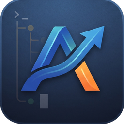

# Git History & Branch Breakdown
* e0fb962 (origin/main, origin/HEAD) docs: update repository URL in README clone instructions
* 96d8e5a docs: add terminal interface demo screenshot to README
* 2716192 (HEAD -> main) Update README.md
* 43917f0 (tag: v0.4.0) feat: visual control plane, app icon branding, and terminal graphics (v0.4.0)
* 5b26be9 docs: update repository URL in README clone instructions
* 83179f7 docs: update repository clone URLs to AIFlow
* 1cfaec8 Update README.md
*   b11904b Merge branch 'feat/ai-subscription-stacks' into main
|\  
| * cf6f2c2 (origin/feat/ai-subscription-stacks) chore: add MIT License
| * 51c3332 (tag: v0.3.0) docs: add comprehensive architectural case study (PDF and Markdown)
* | 2e5b69a Merge pull request #4 from Shrinkhal01/feat/ai-subscription-stacks
|\| 
| * 19e39f0 feat(milestone-3): 3 AI subscription stacks, adaptive guidance, and updated README
* | 21b8be6 Merge pull request #3 from Shrinkhal01/milestone-2
|\| 
| * 8b0c733 (tag: v0.2.0, origin/milestone-2) docs: update DEV_LOG.md current status overview for milestone-2 v0.2.0
| * 73ce372 feat(milestone-2): multi-repo discovery dashboard and test suite integration
* | 3200ff4 Merge pull request #2 from Shrinkhal01/coded-project
|\| 
| * 8a10b05 (tag: v0.1.0, origin/coded-project) chore(release): prepare v0.1.0 Milestone 1 release
* | cb87e8f Merge pull request #1 from Shrinkhal01/coded-project
|\| 
| * 5fba6af docs: update default workflow to 5-phase preset and add lean Rust architecture guidelines
|/  
* 94e5079 chore: update project files
* 1236493 added the plan details and the information on the project

# Project Documentation

<p align="center">
  
</p>

# AIFlow

[](#quickstart)
[](#license)
[%20%7C%20Linux-black?style=for-the-badge&logo=apple)](#technology-stack)

> **A local developer workflow and project-tracking CLI for software engineers building with AI coding agents.**

---

## Quickstart

### 1. Install AIFlow
AIFlow compiles into a single, lightning-fast (<10ms) standalone binary:

```bash
# Clone and install globally
git clone https://github.com/Shrinkhal01/2026-workflow-projects.git aiflow
cd aiflow
cargo install --path .
```

### 2. Track Any Repository
Navigate to any project directory on your machine and let AIFlow guide your development:

```bash
# Step 1: Initialize AIFlow (interactively select your AI Subscription Stack)
cd ~/Projects/my-app
aiflow init

# Step 2: Check current development phase, tasks, test evidence, and Git status
aiflow status

# Step 3: View or switch active AI Subscription Stack anytime
aiflow stack
aiflow stack set claude-coder   # Switch to ChatGPT Planner + Claude Code Pro Coder

# Step 4: Run auto-detected test suite & cache pass/fail evidence
aiflow test run

# Step 5: Get immediate advice on the next action and assigned AI role
aiflow next

# Step 6: Multi-repository fleet dashboard across your whole workspace
aiflow projects
aiflow projects --all

# Step 7: Manage tasks in .aiflow/tasks.md
aiflow task list
aiflow task done TASK-01
aiflow task add "Implement auth middleware"

# Step 8: Advance phases once approved
aiflow phase complete

# Step 9: Verify repository consistency and health
aiflow doctor
```

---

## The Vision

In 2026, AI coding agents (Claude Code, OpenAI Codex, Gemini CLI, Cursor, Windsurf, Aider) make generating code faster than ever. However, managing multiple repositories across different AI tools introduces **context fragmentation and process chaos**:

- *What project was I working on before switching contexts?*
- *What development phase is this repository in?*
- *Did the agent write code before architecture was approved?*
- *Are the tests passing? Has documentation fallen out of sync?*
- *What is the next logical action, and which AI model should I prompt for it?*

**AIFlow is NOT another AI coding agent.**  
AIFlow is the **developer's flight control system**—a blazing-fast, local-first CLI that tracks Git repositories, continuously derives project phase and readiness from Git, tests, docs, and artifacts, and guides the developer step-by-step through a disciplined development workflow.

---

## Core Philosophy

### 1. The Developer is the Final Decision Maker
AI agents propose and implement; the human developer steers, approves architecture, reviews code, and holds ultimate release authority.

### 2. Cognitive Role Specialization
Rather than using a single model for every task, AIFlow structures development around specialized roles:

```
                          ┌──────────────────────────┐
                          │     Human Developer      │
                          │   Requirements & Approvals│
                          └─────────────┬────────────┘
                                        │
                         ┌──────────────┴──────────────┐
                         ▼                             ▼
              Claude (Architect)              Codex (Implementer)
              • System Design                 • Feature Implementation
              • Technical Tradeoffs           • Refactoring & Bug Fixes
              • Architecture Review           • Routine Development
                         │                             │
                         └──────────────┬──────────────┘
                                        ▼
                              Gemini (Review & Test)
                              • Adversarial Code Review
                              • Test Suite Generation
                              • Independent Verification
```

*(Note: Roles and provider bindings are fully customizable to prevent vendor lock-in.)*

### 3. Git as the Ground Truth
AIFlow is non-invasive and non-destructive. It reads Git branches (`phase/*`, `feat/*`), uncommitted changes, commit messages, and repository files to automatically infer state without locking your index or rewriting history.

### 4. Zero Cloud Overhead & Instant Startup
Built in Rust, AIFlow executes in `<15ms`, stores zero proprietary code in the cloud, sends no telemetry, and requires zero external runtimes (no Python virtual environments or Node installations needed).

---

## Pragmatic Workflow & Presets

To strike the ideal balance between deep architectural specifications and developer speed, AIFlow provides **Workflow Presets**, featuring the **5-Phase Workflow (`Specify` → `Plan` → `Build` → `Verify` → `Ship`) as the primary default**:

```
Specify ──> Plan ──> Build ──> Verify ──> Ship
```

| Phase | Scope & Objective | Primary Role & AI Agent | Human Approval Gate |
| :--- | :--- | :--- | :---: |
| **1. Specify** | Requirements, system architecture, scope & tradeoffs | **Architect (Claude + Human)** | **Required** (Spec signoff) |
| **2. Plan** | Milestone planning & granular task checklist (`tasks.md`) | **Architect (Claude)** | Optional |
| **3. Build** | Feature implementation, refactoring, code authoring | **Implementer (Codex / Cursor)** | Continuous |
| **4. Verify** | Test suite execution, adversarial review, edge-case audit | **Reviewer & Tester (Gemini)** | **Required** (Verification signoff) |
| **5. Ship** | Documentation updates, README refresh, git tagging | **Release Lead (Human)** | **Required** (Final release) |

*(Need more or fewer phases? Switch anytime with `--preset lean` for 4 phases or `--preset rigorous` for the 10-phase enterprise lifecycle).*

---

## Planned CLI Experience

### Single-Project Status (`aiflow status`)
```text
Project:      Autonomous Navigation (python)
Location:     /Users/shrinkhals/Projects/autonomous-nav
Last Active:  12 minutes ago (commit 8f3c1b2)

Workflow Progress (Preset: Standard):
  ✓ 1. Specify        (Architecture & Scope approved by Human)
  ✓ 2. Plan           (Tasks defined in tasks.md)
  → 3. Build          [ACTIVE - Codex: TASK-04]
  ○ 4. Verify         (Tests & Code Review)
  ○ 5. Ship           (Docs & Release)


Git Status:
  Branch:       phase/02-object-detection
  Working Tree: 3 modified, 1 untracked
  Upstream:     ahead 1 commit

Test Suite (pytest):
  Status:       14 passed, 2 failed
  Last Run:     45 minutes ago

Current Task:
  TASK-04: Implement object-detection visualization

Documentation:
  Status:       Synchronized (README.md updated 2 days ago)

Next Logical Action:
  → Fix 2 failing tests in test_detector.py with Codex/Gemini
  → Run: aiflow test run
  → Assigned Role: Implementer (Codex)
```

### Next Action Advice (`aiflow next`)
```text
Project: Autonomous Navigation
Current Phase: Implementation

Next Action:
  Implement object-detection visualization in src/detector.py

Recommended Steps:
  1. Generate prompt scaffold:
     $ aiflow prompt --role implementer
  2. Execute unit tests:
     $ aiflow test run
  3. Mark task complete once passing:
     $ aiflow task done TASK-04
```

### Multi-Project Dashboard (`aiflow projects`)
```text
AIFlow Multi-Project Dashboard (4 tracked repositories)

Project                 Phase             Git Status         Tests     Health     Action Needed
------------------------------------------------------------------------------------------------------
Autonomous Navigation   Implementation   phase/02-detection 14/2 fail Attention  Fix 2 failed tests
OnyxBookingSystem       Testing          feat/stripe-v2     All pass  Active     Request code review
OnyxLink                Release          main (clean)       All pass  Done       Ready to tag release
AIFlow                  Architecture     main (clean)       N/A       Active     Approve architecture.md
```

### Repository Health Check (`aiflow doctor`)
```text
AIFlow Health Check: Autonomous Navigation

  [✓] Repository structure: Valid
  [✓] Required artifacts: .aiflow/project.yaml, workflow.yaml present
  [✓] Git working tree: Non-destructive inspection clean
  [!] Test suite: 2 failures detected in test_detector.py
  [✓] Documentation freshness: In sync with recent commits

Doctor Summary: 1 issue requiring attention before advancing to Phase 8 (Code Review).
```

---

## Project Artifacts (`.aiflow/`)

Tracked repositories contain a dedicated `.aiflow/` directory:

```text
.aiflow/
├── project.yaml          # Project identity, language, test runner, role bindings
├── workflow.yaml         # Project-specific phase state machine & transition rules
├── spec.md               # Requirements, system design, architectural decisions
├── tasks.md              # Checkable task list with phase tags
├── state.yaml            # Durable phase progress & human approvals
└── .cache/               # Local test results and volatile cache (Git-ignored)
```

---

## Engineering Specifications

Detailed design documents are maintained in the [`docs/`](docs/) directory:

- [**AIFlow Case Study & Architecture (PDF)**](AIFlow_Case_Study_and_Architecture.pdf): Complete whitepaper and architectural case study covering problem statement, implementation, AI stacks, and real-world workflows.
- [**docs/CASE_STUDY.md**](docs/CASE_STUDY.md): Markdown version of the AIFlow architecture and case study.
- [**docs/PRODUCT.md**](docs/PRODUCT.md): Comprehensive product vision, personas, scope boundaries, and core concepts.
- [**docs/ARCHITECTURE.md**](docs/ARCHITECTURE.md): Technology stack justification (Rust), layered modular design, data models, state heuristics, and test harness.
- [**docs/REQUIREMENTS.md**](docs/REQUIREMENTS.md): Functional and non-functional requirements, ambiguity resolutions, and technical risks.
- [**docs/PROJECT_PLAN.md**](docs/PROJECT_PLAN.md): Minimum Viable Product (MVP) scope, phased development roadmap, work breakdown structure (WBS), and quality gates.
- [**docs/RESEARCH.md**](docs/RESEARCH.md): In-depth competitive analysis of GitHub Spec Kit, OpenSpec, AI agent workflows, and project tracking CLIs.
- [**DEV_LOG.md**](DEV_LOG.md): Living progress log tracking every milestone, decision, and file manifest.

---

## Technology Stack

- **Core Implementation:** **Rust** (2024 edition)
- **CLI Framework:** `clap` (v4 with derive macros)
- **Git Integration:** Fast, safe, non-destructive subprocess execution
- **Terminal Styling & Tables:** `comfy-table`, `owo-colors`
- **Data Serialization:** `serde`, `serde_yaml`, `serde_json`
- **Target Distribution:** Single standalone static binary for macOS (`aarch64` Apple Silicon & `x86_64`) and Linux.

---

## Development Roadmap

- [x] **Phase 0: Architecture & RFC Review** — Specifications, competitive research, and state machine design.
- [x] **Phase 1: MVP Core (v0.1.0)** — Single-repo `init`, `status`, `next`, `phase`, `task`, `doctor`, and Git state detection. *(Completed)*
- [x] **Phase 2: Multi-Project Tracking (v0.2.0)** — `aiflow projects` multi-repo dashboard and workspace discovery. *(Completed)*
- [x] **Phase 3: AI Subscription Stacks & Test Runners (v0.3.0)** — 3 preset AI stacks (`aiflow stack`) and test runner integration (`aiflow test`). *(Completed)*
- [x] **Phase 4: Visual Control Plane & Terminal Branding (v0.4.0)** — App icon assets, iTerm2/Kitty image protocols, clean Fastfetch fallback, and adaptive first-time onboarding. *(Completed)*
- [ ] **Phase 5: Agent Prompt Scaffolding (v0.5.0)** — Context prompt generator (`aiflow prompt`) and doc staleness engine.
- [ ] **Phase 6: Public Distribution (v1.0.0)** — Homebrew tap, CI/CD, and binary releases.

---

## License

Dual-licensed under
- MIT license ([LICENSE-MIT](LICENSE-MIT))

# Key Changes Across Branches

commit 2716192bd0860614800059fabbb92665edee3054
Author: Shrinkhal <97280075+Shrinkhal01@users.noreply.github.com>
Date:   Sat Oct 3 00:32:46 2026 +0530

    Update README.md

 README.md | 5 +----
 1 file changed, 1 insertion(+), 4 deletions(-)

commit 43917f0d884d499694bfc855f185a3efa8be4b74
Author: Shrinkhal <97280075+Shrinkhal01@users.noreply.github.com>
Date:   Sat Oct 3 00:27:36 2026 +0530

    feat: visual control plane, app icon branding, and terminal graphics (v0.4.0)
    
    - Add optimized terminal icon assets (assets/aiflow_terminal.jpg, assets/aiflow_icon.png)
    - Implement iTerm2 and Kitty inline terminal image rendering protocols
    - Implement high-precision 24-bit TrueColor Fastfetch fallback banner
    - Add adaptive project state rendering (first-time onboarding vs. active working stage)
    - Add 'aiflow banner' CLI command and '--welcome' flag
    - Bump version to v0.4.0 across Cargo.toml and documentation

 AIflow.jpg                 | Bin 0 -> 300486 bytes
 Cargo.lock                 |   2 +-
 Cargo.toml                 |   2 +-
 DEV_LOG.md                 |  37 +++--
 README.md                  |  11 +-
 assets/aiflow_icon.png     | Bin 0 -> 83476 bytes
 assets/aiflow_terminal.jpg | Bin 0 -> 18255 bytes
 src/banner.rs              | 340 +++++++++++++++++++++++++++++++++++++++++++++
 src/cli.rs                 |  24 +++-
 src/main.rs                | 156 ++++++++++++++++++---
 src/storage.rs             |  10 ++
 11 files changed, 550 insertions(+), 32 deletions(-)

commit 5b26be94c9aead47f6e1f29c29b8fd3fdf8e7401
Author: Shrinkhal <97280075+Shrinkhal01@users.noreply.github.com>
Date:   Fri Oct 2 08:57:24 2026 +0530

    docs: update repository URL in README clone instructions

 README.md | 2 +-
 1 file changed, 1 insertion(+), 1 deletion(-)

commit 83179f722f51a21d1fc7181174261e562bcb1f46
Author: Shrinkhal <97280075+Shrinkhal01@users.noreply.github.com>
Date:   Fri Oct 2 08:54:43 2026 +0530

    docs: update repository clone URLs to AIFlow

 README.md          | 2 +-
 docs/CASE_STUDY.md | 2 +-
 2 files changed, 2 insertions(+), 2 deletions(-)

commit 1cfaec8579a6c8de847508eb59414622c30f9912
Author: Shrinkhal <97280075+Shrinkhal01@users.noreply.github.com>
Date:   Fri Oct 2 08:50:20 2026 +0530

    Update README.md

commit b11904b144b6a94a6ea7a679ce6b0d6efe34f487
Merge: 2e5b69a cf6f2c2
Author: Shrinkhal <97280075+Shrinkhal01@users.noreply.github.com>
Date:   Fri Oct 2 00:35:04 2026 +0530

    Merge branch 'feat/ai-subscription-stacks' into main

commit cf6f2c21a6f652476e5ac127bf04bb598db55229
Author: Shrinkhal <97280075+Shrinkhal01@users.noreply.github.com>
Date:   Fri Oct 2 00:34:47 2026 +0530

    chore: add MIT License

 LICENSE | 21 +++++++++++++++++++++
 1 file changed, 21 insertions(+)

commit 51c3332138eeb814b93fa1c12bf08bba33f403dd
Author: Shrinkhal <97280075+Shrinkhal01@users.noreply.github.com>
Date:   Fri Oct 2 00:29:04 2026 +0530

    docs: add comprehensive architectural case study (PDF and Markdown)

 AIFlow_Case_Study_and_Architecture.pdf | Bin 0 -> 603230 bytes
 README.md                              |   2 +
 docs/CASE_STUDY.md                     | 307 +++++++++++++++++++++++++++++++++
 3 files changed, 309 insertions(+)

commit 2e5b69ad8fa537c2a2ab9a2488f152dd75c2ec8a
Merge: 21b8be6 19e39f0
Author: Shrinkhal <97280075+Shrinkhal01@users.noreply.github.com>
Date:   Fri Oct 2 00:21:39 2026 +0530

    Merge pull request #4 from Shrinkhal01/feat/ai-subscription-stacks
    
    feat(milestone-3): 3 AI subscription stacks, adaptive guidance, and u…

commit 19e39f06f6958dcfb88d6345f2d29a2458eca966
Author: Shrinkhal <97280075+Shrinkhal01@users.noreply.github.com>
Date:   Fri Oct 2 00:20:39 2026 +0530

    feat(milestone-3): 3 AI subscription stacks, adaptive guidance, and updated README

 .aiflow/project.yaml |   5 +-
 Cargo.lock           |   2 +-
 Cargo.toml           |   2 +-
 DEV_LOG.md           |  16 +++---
 README.md            |  33 ++++++++----
 docs/PRODUCT.md      |  11 +++-
 src/cli.rs           |  23 +++++++-
 src/discovery.rs     |   2 +-
 src/domain.rs        | 149 +++++++++++++++++++++++++++++++++++++++++++++++----
 src/fsm.rs           |  84 ++++++++++++++++++++++-------
 src/main.rs          | 119 +++++++++++++++++++++++++++++++++++++---
 src/storage.rs       |  11 +++-
 12 files changed, 398 insertions(+), 59 deletions(-)

commit 21b8be69d2c3bda1f69ad82b30117658083c5b45
Merge: 3200ff4 8b0c733
Author: Shrinkhal <97280075+Shrinkhal01@users.noreply.github.com>
Date:   Thu Oct 1 23:56:37 2026 +0530

    Merge pull request #3 from Shrinkhal01/milestone-2
    
    Milestone 2

commit 3200ff4feedad5130467a14009195f93cf5b3b78
Merge: cb87e8f 8a10b05
Author: Shrinkhal <97280075+Shrinkhal01@users.noreply.github.com>
Date:   Thu Oct 1 23:56:16 2026 +0530

    Merge pull request #2 from Shrinkhal01/coded-project
    
    chore(release): prepare v0.1.0 Milestone 1 release

commit 8b0c7338cae3916e46f181855814091bab0a5db8
Author: Shrinkhal <97280075+Shrinkhal01@users.noreply.github.com>
Date:   Thu Oct 1 23:55:22 2026 +0530

    docs: update DEV_LOG.md current status overview for milestone-2 v0.2.0

 DEV_LOG.md | 7 ++++---
 1 file changed, 4 insertions(+), 3 deletions(-)

commit 73ce3724d79aee8daa185ade0272666884bccc7a
Author: Shrinkhal <97280075+Shrinkhal01@users.noreply.github.com>
Date:   Thu Oct 1 23:48:18 2026 +0530

    feat(milestone-2): multi-repo discovery dashboard and test suite integration

 Cargo.lock       |  31 ++++++-
 Cargo.toml       |   3 +-
 DEV_LOG.md       |  43 ++++++---
 src/cli.rs       |  45 +++++++++-
 src/config.rs    | 115 ++++++++++++++++++++++++
 src/discovery.rs | 260 +++++++++++++++++++++++++++++++++++++++++++++++++++++++
 src/fsm.rs       |  18 ++++
 src/main.rs      | 129 ++++++++++++++++++++++++++-
 src/tester.rs    | 159 ++++++++++++++++++++++++++++++++++
 9 files changed, 786 insertions(+), 17 deletions(-)

commit 8a10b05f5e0938dcccc39250c7324c92cc5d4599
Author: Shrinkhal <97280075+Shrinkhal01@users.noreply.github.com>
Date:   Thu Oct 1 23:31:09 2026 +0530

    chore(release): prepare v0.1.0 Milestone 1 release

 DEV_LOG.md | 3 ++-
 1 file changed, 2 insertions(+), 1 deletion(-)

commit cb87e8f22147ca0784f4f2423c356155d209cd93
Merge: 94e5079 5fba6af
Author: Shrinkhal <97280075+Shrinkhal01@users.noreply.github.com>
Date:   Thu Oct 1 21:41:51 2026 +0530

    Merge pull request #1 from Shrinkhal01/coded-project
    
    docs: update default workflow to 5-phase preset and add lean Rust arc…

commit 5fba6afc2c45625213f368e3463d2073bf1e9a21
Author: Shrinkhal <97280075+Shrinkhal01@users.noreply.github.com>
Date:   Thu Oct 1 21:30:36 2026 +0530

    docs: update default workflow to 5-phase preset and add lean Rust architecture guidelines

 .aiflow/project.yaml  |  10 +
 .aiflow/spec.md       |  12 +
 .aiflow/state.yaml    |   8 +
 .aiflow/tasks.md      |   5 +
 .aiflow/workflow.yaml |  37 +++
 .gitignore            |   4 +
 Cargo.lock            | 780 ++++++++++++++++++++++++++++++++++++++++++++++++++
 Cargo.toml            |  18 ++
 DEV_LOG.md            |  69 +++++
 README.md             | 116 +++++---
 docs/ARCHITECTURE.md  | 100 +++----
 docs/PRODUCT.md       |  77 ++---
 docs/PROJECT_PLAN.md  |   5 +-
 src/cli.rs            |  91 ++++++
 src/doctor.rs         | 125 ++++++++
 src/domain.rs         | 230 +++++++++++++++
 src/fsm.rs            | 120 ++++++++
 src/git.rs            |  86 ++++++
 src/main.rs           | 298 +++++++++++++++++++
 src/storage.rs        | 214 ++++++++++++++
 20 files changed, 2259 insertions(+), 146 deletions(-)

commit 94e5079e8dbb486b6330fee358781c93c2790bbe
Author: Shrinkhal <97280075+Shrinkhal01@users.noreply.github.com>
Date:   Thu Oct 1 16:35:04 2026 +0530

    chore: update project files

 AIFlow Architecture_ Layer-by-Layer Breakdown.pdf | Bin 0 -> 98115 bytes
 1 file changed, 0 insertions(+), 0 deletions(-)

commit 12364933d9299d9126c44ce4815e7f4450bf073a
Author: Shrinkhal <97280075+Shrinkhal01@users.noreply.github.com>
Date:   Thu Oct 1 14:04:27 2026 +0530

    added the plan details and the information on the project

 README.md            | 241 +++++++++++++++++++++++++
 docs/ARCHITECTURE.md | 498 +++++++++++++++++++++++++++++++++++++++++++++++++++
 docs/PRODUCT.md      | 157 ++++++++++++++++
 docs/PROJECT_PLAN.md | 149 +++++++++++++++
 docs/REQUIREMENTS.md | 170 ++++++++++++++++++
 docs/RESEARCH.md     | 168 +++++++++++++++++
 6 files changed, 1383 insertions(+)
